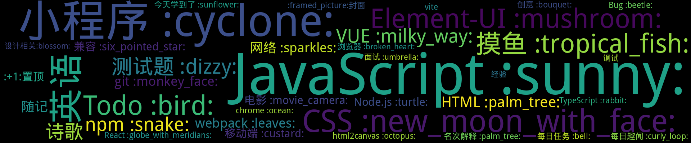

    
    
    
    
    
    
    

    

[ Shine]

    
## 置顶 :thumbsup: 
- [读书是为了什么？](https://github.com/smileyby/notes/issues/175)  0 :speech_balloon:  	 
- [你想住在中国哪里？（转自阮一峰周刊第180期）](https://github.com/smileyby/notes/issues/167)  0 :speech_balloon:  	 
- [掘金小册：小程序底层框架实现原理-笔记](https://github.com/smileyby/notes/issues/165)  0 :speech_balloon:  	 
## 最新 :new: 

#### [突然很空虚？你是languishing了！](https://github.com/smileyby/notes/issues/198) 0 :speech_balloon: 	 2021-11-29 08:55:35

:label: : [英语](https://github.com/smileyby/ghiblog/labels/%E8%8B%B1%E8%AF%AD)

你有没有曾经被一种莫名其妙的情绪所困扰，突然感觉自己被掏空，无精打采。
很多人以为自己是抑郁了，这种状态其实是-平静但又绝望的生活，就是我们今天说的languishing.
它包含的症状：
做什么都打不起精神，对什么都提不起兴趣，很难集中注意力。觉得自己的生活很无趣，虽然想改变但是找不到出路。

[更多>>>](https://github.com/smileyby/notes/issues/198)

---

#### [Todo：在掘金写一篇关于 chrome 插件的文章](https://github.com/smileyby/notes/issues/197) 0 :speech_balloon: 	 2021-11-29 02:50:40

:label: : [Todo :bird:](https://github.com/smileyby/ghiblog/labels/Todo%20%3Abird%3A)

[更多>>>](https://github.com/smileyby/notes/issues/197)

---

#### [纯JS将内容转为 二维码](https://github.com/smileyby/notes/issues/196) 0 :speech_balloon: 	 2021-11-26 08:10:47

:label: : [Todo :bird:](https://github.com/smileyby/ghiblog/labels/Todo%20%3Abird%3A)

二维码的诞生：https://www.qrcode.com/zh/history/

[更多>>>](https://github.com/smileyby/notes/issues/196)

---

#### [英文口头禅](https://github.com/smileyby/notes/issues/195) 0 :speech_balloon: 	 2021-11-24 07:05:57

:label: : [英语](https://github.com/smileyby/ghiblog/labels/%E8%8B%B1%E8%AF%AD)

【01】So far so good!
过得去；到目前为止，一直都还不错
例句：The work is rather difficult， but so far so good。工作相当困难，但到目前为此还算顺利。

【02】Believe it or not！
信不信由你！
例句：Be

[更多>>>](https://github.com/smileyby/notes/issues/195)

---

#### [Morning call](https://github.com/smileyby/notes/issues/194) 1 :speech_balloon: 	 2021-11-24 02:51:49

:label: : [英语](https://github.com/smileyby/ghiblog/labels/%E8%8B%B1%E8%AF%AD)

You may give up after trying, but never give up trying.
尝试后可能会放弃，但千万不能放弃尝试。

[更多>>>](https://github.com/smileyby/notes/issues/194)

---

## 分类  :card_file_box: 

    

        
        
:cloud: 词云 :cloud: 点击词云展开详细分类:point_down: 

    

:+1:置顶	3:newspaper:

- [读书是为了什么？](https://github.com/smileyby/notes/issues/175)  0 :speech_balloon:  	 
- [你想住在中国哪里？（转自阮一峰周刊第180期）](https://github.com/smileyby/notes/issues/167)  0 :speech_balloon:  	 
- [掘金小册：小程序底层框架实现原理-笔记](https://github.com/smileyby/notes/issues/165)  0 :speech_balloon:  	 

:framed_picture:封面	1:newspaper:

- [封面图](https://github.com/smileyby/notes/issues/1)  1 :speech_balloon:  	 

Bug :beetle:	1:newspaper:

- [分页加载数据，动态计算高度不准确bug](https://github.com/smileyby/notes/issues/143)  0 :speech_balloon:  	 

chrome :ocean:	1:newspaper:

- [Chrome 调试移动端H5页面](https://github.com/smileyby/notes/issues/129)  0 :speech_balloon:  	 

chrome扩展	1:newspaper:

- [Chrome插件](https://github.com/smileyby/notes/issues/190)  0 :speech_balloon:  	 

CSS :new_moon_with_face:	15:newspaper:

- [CSS打字效果实现](https://github.com/smileyby/notes/issues/177)  0 :speech_balloon:  	 
- [position:absolute 在某些尺寸下即使 定位设置为0，仍然存在间隙为什么？](https://github.com/smileyby/notes/issues/171)  1 :speech_balloon:  	 
- [max-width 对元素尺寸的影响？](https://github.com/smileyby/notes/issues/154)  0 :speech_balloon:  	 
- [用css写判断条件](https://github.com/smileyby/notes/issues/152)  2 :speech_balloon:  	 
- [position:sticky  粘性布局](https://github.com/smileyby/notes/issues/147)  1 :speech_balloon:  	 
- [CSS：IOS系统下，一行代码实现简体和繁体切换](https://github.com/smileyby/notes/issues/131)  0 :speech_balloon:  	 
- [CSS：object-fit](https://github.com/smileyby/notes/issues/58)  0 :speech_balloon:  	 
- [CSS：border绘制不同的图形](https://github.com/smileyby/notes/issues/57)  0 :speech_balloon:  	 
- [CSS：各大网站实现灰度的方法](https://github.com/smileyby/notes/issues/56)  0 :speech_balloon:  	 
- [CSS：主题快捷切换](https://github.com/smileyby/notes/issues/55)  0 :speech_balloon:  	 
- [CSS：flex两栏布局，不设置父元素宽度，内部子元素会超出](https://github.com/smileyby/notes/issues/54)  0 :speech_balloon:  	 
- [CSS：炫酷的CSS效果](https://github.com/smileyby/notes/issues/53)  0 :speech_balloon:  	 
- [CSS：font-weight 设置数值在不同浏览器中解析效果不一致](https://github.com/smileyby/notes/issues/52)  0 :speech_balloon:  	 
- [CSS：图片加载失败兜底方案实现--转自张鑫旭博客](https://github.com/smileyby/notes/issues/51)  0 :speech_balloon:  	 
- [CSS：inline-block元素并排排列，如果元素高度不一致会产生元素之间上下偏移问题 ](https://github.com/smileyby/notes/issues/50)  0 :speech_balloon:  	 

Element-UI :mushroom:	10:newspaper:

- [ElementUI el-tree 加入搜索在清除筛选项时会默认展开全部子节点](https://github.com/smileyby/notes/issues/168)  0 :speech_balloon:  	 
- [Element： 在el-row 或者 el-col 上使用@click失效](https://github.com/smileyby/notes/issues/48)  0 :speech_balloon:  	 
- [Elementui-cascader级联选择组件](https://github.com/smileyby/notes/issues/47)  0 :speech_balloon:  	 
- [Element： ref 被重新赋值](https://github.com/smileyby/notes/issues/46)  0 :speech_balloon:  	 
- [Element: el-date-picker 点击 × 清除数据，会将model绑定值重置为 null](https://github.com/smileyby/notes/issues/45)  0 :speech_balloon:  	 
- [Element：el-date-picker,value值要传字符串](https://github.com/smileyby/notes/issues/44)  0 :speech_balloon:  	 
- [Element：树结构，默认会将节点值转成字符串](https://github.com/smileyby/notes/issues/43)  0 :speech_balloon:  	 
- [Element：自定义表单效验规则要保证 callback必然会被执行](https://github.com/smileyby/notes/issues/42)  0 :speech_balloon:  	 
- [Elementui：table summary-method 方法动态更新](https://github.com/smileyby/notes/issues/38)  0 :speech_balloon:  	 
- [Elementui：elementui 滚动条组件](https://github.com/smileyby/notes/issues/37)  0 :speech_balloon:  	 

git :monkey_face:	3:newspaper:

- [Git：常用命令](https://github.com/smileyby/notes/issues/90)  0 :speech_balloon:  	 
- [Git：git branch branchName和git checkout -b branchName区别](https://github.com/smileyby/notes/issues/41)  0 :speech_balloon:  	 
- [Git：常用命令汇总 ](https://github.com/smileyby/notes/issues/40)  0 :speech_balloon:  	 

HTML :palm_tree:	4:newspaper:

- [HTML draggable 属性实现拖拽](https://github.com/smileyby/notes/issues/144)  1 :speech_balloon:  	 
- [input 修改光标颜色 caret-color](https://github.com/smileyby/notes/issues/109)  0 :speech_balloon:  	 
- [HTML：Unicode 编码的用途](https://github.com/smileyby/notes/issues/77)  0 :speech_balloon:  	 
- [HTML：实现a元素href URL链接自动刷新或新窗口打开](https://github.com/smileyby/notes/issues/69)  0 :speech_balloon:  	 

html2canvas :octopus:	1:newspaper:

- [html2canvas 相关问题](https://github.com/smileyby/notes/issues/49)  0 :speech_balloon:  	 

JavaScript :sunny:	31:newspaper:

- [浏览器端下载文件](https://github.com/smileyby/notes/issues/166)  0 :speech_balloon:  	 
- [module.exports 与 export 区别 ](https://github.com/smileyby/notes/issues/148)  1 :speech_balloon:  	 
- [获取图片 exif 信息](https://github.com/smileyby/notes/issues/136)  0 :speech_balloon:  	 
- [JS Is Weird](https://github.com/smileyby/notes/issues/123)  1 :speech_balloon:  	 
- [就像const 一样，let不会在全局声明时（在最顶部的范围）创建window 对象的属性](https://github.com/smileyby/notes/issues/120)  0 :speech_balloon:  	 
- [An incomplete list of skills senior engineers need, beyond coding](https://github.com/smileyby/notes/issues/115)  0 :speech_balloon:  	 
- [Javascript：match 方法获取捕获分组，要去掉正则修饰符 g](https://github.com/smileyby/notes/issues/114)  0 :speech_balloon:  	 
- [函数形参是按值传递](https://github.com/smileyby/notes/issues/110)  0 :speech_balloon:  	 
- [作用域·测试题](https://github.com/smileyby/notes/issues/107)  2 :speech_balloon:  	 
- [JavaScript中的ReferenceError和TypeError两种错误的区别](https://github.com/smileyby/notes/issues/105)  0 :speech_balloon:  	 
- [JS：class类声明的静态方法只能内部使用](https://github.com/smileyby/notes/issues/87)  0 :speech_balloon:  	 
- [JS：模板字符串的扩展功能-实现函数调用](https://github.com/smileyby/notes/issues/86)  0 :speech_balloon:  	 
- [JS：localStorage 分域名存储](https://github.com/smileyby/notes/issues/85)  0 :speech_balloon:  	 
- [JS：canvas动态获取绘制文字的宽度 CanvasRenderingContext2D.measureText()](https://github.com/smileyby/notes/issues/84)  0 :speech_balloon:  	 
- [JS：safari浏览器禁止多指操作默认事件，并解决图片长按放大问题](https://github.com/smileyby/notes/issues/83)  0 :speech_balloon:  	 
- [JS：判断一个对象会否存在循环引用，直接使用JSON.stringify](https://github.com/smileyby/notes/issues/82)  0 :speech_balloon:  	 
- [JS：获取月份最后一天](https://github.com/smileyby/notes/issues/81)  0 :speech_balloon:  	 
- [JS：Number 最大值 Math.pow(2, 53) ](https://github.com/smileyby/notes/issues/80)  0 :speech_balloon:  	 
- [JS：关于websocket的心跳检测](https://github.com/smileyby/notes/issues/79)  0 :speech_balloon:  	 
- [JS：eval() 替代方法](https://github.com/smileyby/notes/issues/78)  0 :speech_balloon:  	 
- [JS：计算精度问题](https://github.com/smileyby/notes/issues/68)  0 :speech_balloon:  	 
- [JS：import命令是编译阶段执行的，在代码运行之前](https://github.com/smileyby/notes/issues/67)  0 :speech_balloon:  	 
- [JS：padStart](https://github.com/smileyby/notes/issues/66)  0 :speech_balloon:  	 
- [JS：用includes方法替代或判断，替代indexOf方法](https://github.com/smileyby/notes/issues/65)  0 :speech_balloon:  	 
- [JS：String与new String](https://github.com/smileyby/notes/issues/64)  0 :speech_balloon:  	 
- [JS：获取某一天的前三天和后三天的日期](https://github.com/smileyby/notes/issues/63)  0 :speech_balloon:  	 
- [JavaScript：window.history](https://github.com/smileyby/notes/issues/61)  0 :speech_balloon:  	 
- [ES6：Set:](https://github.com/smileyby/notes/issues/60)  0 :speech_balloon:  	 
- [ES7：?? 空值合并操作符](https://github.com/smileyby/notes/issues/59)  0 :speech_balloon:  	 
- [JavaScript：URLSearchParams 解析地址栏参数](https://github.com/smileyby/notes/issues/32)  0 :speech_balloon:  	 
- [JavaScript：可迭代对象的两个必要条件](https://github.com/smileyby/notes/issues/31)  0 :speech_balloon:  	 

Node.js :turtle:	2:newspaper:

- [Node Sass does not yet support your current environment: Windows 64-bit with](https://github.com/smileyby/notes/issues/173)  1 :speech_balloon:  	 
- [npm node 安装包依赖 他们三者时间到底是个什么关系？](https://github.com/smileyby/notes/issues/145)  0 :speech_balloon:  	 

npm :snake:	6:newspaper:

- [npm报错](https://github.com/smileyby/notes/issues/182)  1 :speech_balloon:  	 
- [Node Sass does not yet support your current environment: Windows 64-bit with](https://github.com/smileyby/notes/issues/173)  1 :speech_balloon:  	 
- [npm node 安装包依赖 他们三者时间到底是个什么关系？](https://github.com/smileyby/notes/issues/145)  0 :speech_balloon:  	 
- [package.json 和 package.lock.json 区别和作用](https://github.com/smileyby/notes/issues/141)  0 :speech_balloon:  	 
- [命令行：VUE 不是内部命令](https://github.com/smileyby/notes/issues/101)  0 :speech_balloon:  	 
- [Install fail! Error: EPERM: operation not permitted, symlink](https://github.com/smileyby/notes/issues/94)  0 :speech_balloon:  	 

React :globe_with_meridians:	3:newspaper:

- [npm报错](https://github.com/smileyby/notes/issues/182)  1 :speech_balloon:  	 
- [useEffect  useState useMemo  作用](https://github.com/smileyby/notes/issues/179)  0 :speech_balloon:  	 
- [React 项目配置less](https://github.com/smileyby/notes/issues/74)  0 :speech_balloon:  	 

Todo :bird:	14:newspaper:

- [Todo：在掘金写一篇关于 chrome 插件的文章](https://github.com/smileyby/notes/issues/197)  0 :speech_balloon:  	 
- [纯JS将内容转为 二维码](https://github.com/smileyby/notes/issues/196)  0 :speech_balloon:  	 
- [useEffect  useState useMemo  作用](https://github.com/smileyby/notes/issues/179)  0 :speech_balloon:  	 
- [Todo：URL 组成部分](https://github.com/smileyby/notes/issues/176)  0 :speech_balloon:  	 
- [Todo：树结构扁平化-递归实现](https://github.com/smileyby/notes/issues/163)  0 :speech_balloon:  	 
- [Todo：了解 web components](https://github.com/smileyby/notes/issues/160)  0 :speech_balloon:  	 
- [Todo：了解 WebIDE ](https://github.com/smileyby/notes/issues/159)  0 :speech_balloon:  	 
- [TODO：TypeScript](https://github.com/smileyby/notes/issues/138)  0 :speech_balloon:  	 
- [Todo：WebGL](https://github.com/smileyby/notes/issues/134)  0 :speech_balloon:  	 
- [Todo：node](https://github.com/smileyby/notes/issues/133)  0 :speech_balloon:  	 
- [Todo：递归](https://github.com/smileyby/notes/issues/128)  0 :speech_balloon:  	 
- [Todo：框架：vue和react回顾，JS基础回顾](https://github.com/smileyby/notes/issues/111)  1 :speech_balloon:  	 
- [Vite：vite替换webpack](https://github.com/smileyby/notes/issues/98)  2 :speech_balloon:  	 
- [小程序：todo-list](https://github.com/smileyby/notes/issues/27)  0 :speech_balloon:  	 

TypeScript :rabbit:	1:newspaper:

- [TS：vscode安装完typescript执行tsc报错](https://github.com/smileyby/notes/issues/75)  0 :speech_balloon:  	 

vite	1:newspaper:

- [vite原理](https://github.com/smileyby/notes/issues/174)  0 :speech_balloon:  	 

VUE :milky_way:	5:newspaper:

- [VUE：export default{ } 和export default Vue.extend({}）区别](https://github.com/smileyby/notes/issues/102)  0 :speech_balloon:  	 
- [[Vue warn]: Templates should only be responsible for mapping the state to the UI](https://github.com/smileyby/notes/issues/73)  0 :speech_balloon:  	 
- [[Vue warn]: Avoid mutating a prop directly since the value will be overwritten whenever the parent component re-renders. Instead, use a data or computed property based on the prop's value.](https://github.com/smileyby/notes/issues/72)  0 :speech_balloon:  	 
- [VUE：Warn : [vue-router] Duplicate named routes definition](https://github.com/smileyby/notes/issues/71)  0 :speech_balloon:  	 
- [VUE：vue-cli · Failed to download repo vuejs-templates/webpack: getaddrinfo ENOTFOUND github.com github.com:443](https://github.com/smileyby/notes/issues/70)  0 :speech_balloon:  	 

webpack :leaves:	3:newspaper:

- [package.json 和 package.lock.json 区别和作用](https://github.com/smileyby/notes/issues/141)  0 :speech_balloon:  	 
- [webpack编译时遇到的问题“Error: Cannot find module ‘webpack-cli/bin/config-yargs‘.....“](https://github.com/smileyby/notes/issues/127)  0 :speech_balloon:  	 
- [Webpack：TypeError: Cannot destructure property 'compile' of 'undefined' or 'null'](https://github.com/smileyby/notes/issues/30)  0 :speech_balloon:  	 

今天学到了 :sunflower:	1:newspaper:

- [小程序内如何引导用户关注公众号](https://github.com/smileyby/notes/issues/135)  0 :speech_balloon:  	 

兼容 :six_pointed_star:	2:newspaper:

- [PC端：IE表格边框消失](https://github.com/smileyby/notes/issues/29)  0 :speech_balloon:  	 
- [移动端：IOS，getTime(),getFullYear()等返回显示NaN](https://github.com/smileyby/notes/issues/28)  0 :speech_balloon:  	 

创意 :bouquet:	1:newspaper:

- [创意：网站](https://github.com/smileyby/notes/issues/92)  0 :speech_balloon:  	 

名次解释 :palm_tree:	1:newspaper:

- [统计指标：汇总](https://github.com/smileyby/notes/issues/99)  0 :speech_balloon:  	 

小程序 :cyclone:	26:newspaper:

- [page-meta 可设置小程序页面属性](https://github.com/smileyby/notes/issues/192)  0 :speech_balloon:  	 
- [掘金小册：小程序底层框架实现原理-笔记](https://github.com/smileyby/notes/issues/165)  0 :speech_balloon:  	 
- [小程序码生成问题](https://github.com/smileyby/notes/issues/164)  0 :speech_balloon:  	 
- [小程序授权获取不到unionid可能原因](https://github.com/smileyby/notes/issues/162)  0 :speech_balloon:  	 
- [小程序：canvas实现头像合成，并保存到相册](https://github.com/smileyby/notes/issues/161)  1 :speech_balloon:  	 
- [H5 唤醒小程序方法](https://github.com/smileyby/notes/issues/158)  1 :speech_balloon:  	 
- [小程序组件内 引用父组件样式](https://github.com/smileyby/notes/issues/137)  0 :speech_balloon:  	 
- [小程序内如何引导用户关注公众号](https://github.com/smileyby/notes/issues/135)  0 :speech_balloon:  	 
- [小程序：微信api=>wxacode.get=>生成小程序码并不支持白色线条](https://github.com/smileyby/notes/issues/112)  0 :speech_balloon:  	 
- [小程序：todo-list](https://github.com/smileyby/notes/issues/27)  0 :speech_balloon:  	 
- [小程序：TEXT标签还能嵌套text标签，其他标签无效 ](https://github.com/smileyby/notes/issues/26)  0 :speech_balloon:  	 
- [小程序：组件内【boundingClientRect】方法获取元素高度时，返回null](https://github.com/smileyby/notes/issues/25)  0 :speech_balloon:  	 
- [小程序：scroll-view组件内部元素直接添加阴影会被截断 ](https://github.com/smileyby/notes/issues/24)  0 :speech_balloon:  	 
- [小程序：Some selectors are not allowed in component wxss, including tag name](https://github.com/smileyby/notes/issues/23)  0 :speech_balloon:  	 
- [小程序：使用定位，在ios中可能会导致横向滚动](https://github.com/smileyby/notes/issues/22)  0 :speech_balloon:  	 
- [小程序：wx.request:fail ssl hand shake error](https://github.com/smileyby/notes/issues/21)  0 :speech_balloon:  	 
- [小程序：请求接口报错：-202::NET::ERR_CERT_AUTHORITY_INVALID](https://github.com/smileyby/notes/issues/20)  0 :speech_balloon:  	 
- [小程序：微信更新7.0.10后，onShow 中 调用wx.hideLoading失效](https://github.com/smileyby/notes/issues/19)  0 :speech_balloon:  	 
- [小程序：云开发](https://github.com/smileyby/notes/issues/18)  0 :speech_balloon:  	 
- [小程序：{{}}取值运算符，不能运行indexOf方法的解决办法](https://github.com/smileyby/notes/issues/17)  0 :speech_balloon:  	 
- [小程序：video播放器设置opacity:0在ios设备上不能播放 ](https://github.com/smileyby/notes/issues/16)  0 :speech_balloon:  	 
- [小程序：扫码打开对应界面，接收的参数](https://github.com/smileyby/notes/issues/15)  0 :speech_balloon:  	 
- [小程序：同一个元素 绑定长按和点击事件，两个事件会同时执行](https://github.com/smileyby/notes/issues/14)  0 :speech_balloon:  	 
- [小程序：wx.setStorageSync()和wx.setStorage()两个方法接受的参数不一致](https://github.com/smileyby/notes/issues/13)  0 :speech_balloon:  	 
- [小程序：thirdScriptError Cannot read property 'name' of undefined TypeError: Cannot read property 'name' of undefined](https://github.com/smileyby/notes/issues/12)  0 :speech_balloon:  	 
- [小程序：scroll-view 组件 scroll-left 问题](https://github.com/smileyby/notes/issues/10)  0 :speech_balloon:  	 

开源	0:newspaper:

插件 :sun_with_face:	0:newspaper:

摸鱼 :tropical_fish:	11:newspaper:

- [网易云·摸鱼计算器](https://github.com/smileyby/notes/issues/187)  0 :speech_balloon:  	 
- [How Rich Am I?](https://github.com/smileyby/notes/issues/157)  0 :speech_balloon:  	 
- [摸鱼奖品陈列室](https://github.com/smileyby/notes/issues/156)  0 :speech_balloon:  	 
- [推荐电影：最后的城堡](https://github.com/smileyby/notes/issues/139)  0 :speech_balloon:  	 
- [一起来画画](https://github.com/smileyby/notes/issues/124)  0 :speech_balloon:  	 
- [EN：Minor Heat ](https://github.com/smileyby/notes/issues/122)  0 :speech_balloon:  	 
- [网易云：一则广告](https://github.com/smileyby/notes/issues/103)  0 :speech_balloon:  	 
- [摸鱼：1024-js代码排行](https://github.com/smileyby/notes/issues/62)  0 :speech_balloon:  	 
- [摸鱼：神兽](https://github.com/smileyby/notes/issues/35)  0 :speech_balloon:  	 
- [摸鱼：漫画-我要摆地摊](https://github.com/smileyby/notes/issues/34)  0 :speech_balloon:  	 
- [摸鱼：推荐电影](https://github.com/smileyby/notes/issues/33)  0 :speech_balloon:  	 

每日任务 :bell:	1:newspaper:

- [下载文件请求头是啥样子的？](https://github.com/smileyby/notes/issues/146)  0 :speech_balloon:  	 

每日趣闻 :curly_loop:	1:newspaper:

- [程序员的酒后真言](https://github.com/smileyby/notes/issues/116)  0 :speech_balloon:  	 

测试题 :dizzy:	7:newspaper:

- [测试题：作用域](https://github.com/smileyby/notes/issues/180)  0 :speech_balloon:  	 
- [测试题：Promise](https://github.com/smileyby/notes/issues/151)  3 :speech_balloon:  	 
- [测试题：Promise相关](https://github.com/smileyby/notes/issues/150)  3 :speech_balloon:  	 
- [函数形参是按值传递](https://github.com/smileyby/notes/issues/110)  0 :speech_balloon:  	 
- [作用域·测试题](https://github.com/smileyby/notes/issues/107)  2 :speech_balloon:  	 
- [测试题：运算符优先级 + new + 原型链](https://github.com/smileyby/notes/issues/100)  0 :speech_balloon:  	 
- [测试题：原型原型链](https://github.com/smileyby/notes/issues/96)  0 :speech_balloon:  	 

浏览器 :broken_heart:	1:newspaper:

- [Chrome：Chrome 团队计划冻结浏览器请求的 User-Agent 字段，改用一个新的 API 取代 ](https://github.com/smileyby/notes/issues/36)  0 :speech_balloon:  	 

电影 :movie_camera:	3:newspaper:

- [电影：藏草青青](https://github.com/smileyby/notes/issues/183)  0 :speech_balloon:  	 
- [推荐电影：最后的城堡](https://github.com/smileyby/notes/issues/139)  0 :speech_balloon:  	 
- [推荐电影：《给我翅膀》](https://github.com/smileyby/notes/issues/125)  0 :speech_balloon:  	 

移动端 :custard:	2:newspaper:

- [Chrome 调试移动端H5页面](https://github.com/smileyby/notes/issues/129)  0 :speech_balloon:  	 
- [移动端：安卓手机获取app缓存文件](https://github.com/smileyby/notes/issues/91)  0 :speech_balloon:  	 

程序员段子 :laughing:	0:newspaper:

程序员表情包 :flushed:	0:newspaper:

经验	2:newspaper:

- [前端图谱](https://github.com/smileyby/notes/issues/181)  0 :speech_balloon:  	 
- [日常总结](https://github.com/smileyby/notes/issues/142)  0 :speech_balloon:  	 

网络 :sparkles:	3:newspaper:

- [网络：关于OPTIONS请求](https://github.com/smileyby/notes/issues/89)  0 :speech_balloon:  	 
- [网络：HTTP状态码](https://github.com/smileyby/notes/issues/88)  0 :speech_balloon:  	 
- [TCP 三次/四次握手](https://github.com/smileyby/notes/issues/39)  0 :speech_balloon:  	 

英语	22:newspaper:

- [突然很空虚？你是languishing了！](https://github.com/smileyby/notes/issues/198)  0 :speech_balloon:  	 
- [英文口头禅](https://github.com/smileyby/notes/issues/195)  0 :speech_balloon:  	 
- [Morning call](https://github.com/smileyby/notes/issues/194)  1 :speech_balloon:  	 
- [Morning call](https://github.com/smileyby/notes/issues/193)  0 :speech_balloon:  	 
- [Morning Call](https://github.com/smileyby/notes/issues/191)  0 :speech_balloon:  	 
- [Morning call](https://github.com/smileyby/notes/issues/189)  0 :speech_balloon:  	 
- [EN：Morning Call](https://github.com/smileyby/notes/issues/186)  0 :speech_balloon:  	 
- [reserved word  保留字](https://github.com/smileyby/notes/issues/153)  0 :speech_balloon:  	 
- [EN：Home free => 胜利在望](https://github.com/smileyby/notes/issues/140)  0 :speech_balloon:  	 
- [EN：形容词的高级替换](https://github.com/smileyby/notes/issues/132)  0 :speech_balloon:  	 
- [EN:Tell me about it](https://github.com/smileyby/notes/issues/130)  0 :speech_balloon:  	 
- [EN：pull yourself together](https://github.com/smileyby/notes/issues/126)  0 :speech_balloon:  	 
- [EN：Nothing ventured, nothing gained.](https://github.com/smileyby/notes/issues/121)  0 :speech_balloon:  	 
- [EN：Whatever you do](https://github.com/smileyby/notes/issues/119)  0 :speech_balloon:  	 
- [EN：the proof is in the pudding](https://github.com/smileyby/notes/issues/118)  0 :speech_balloon:  	 
- [To see the world, things dangerous to come to ,to see behind walls ,to draw closer ,to find each other and to feel .That is the purpose of life .](https://github.com/smileyby/notes/issues/117)  0 :speech_balloon:  	 
- [An incomplete list of skills senior engineers need, beyond coding](https://github.com/smileyby/notes/issues/115)  0 :speech_balloon:  	 
- [EN：碧昂丝 2020毕业生致辞节选](https://github.com/smileyby/notes/issues/113)  1 :speech_balloon:  	 
- [girls in blue](https://github.com/smileyby/notes/issues/108)  0 :speech_balloon:  	 
- [Nothing worthwhile is easy. 有价值的事物得之不易](https://github.com/smileyby/notes/issues/106)  0 :speech_balloon:  	 
- [EN:想得美](https://github.com/smileyby/notes/issues/104)  0 :speech_balloon:  	 
- [EN:butterflies in my stomach](https://github.com/smileyby/notes/issues/97)  0 :speech_balloon:  	 

设计相关:blossom:	1:newspaper:

- [一起来画画](https://github.com/smileyby/notes/issues/124)  0 :speech_balloon:  	 

诗歌	7:newspaper:

- [白鹿洞二首其一·王贞白](https://github.com/smileyby/notes/issues/188)  0 :speech_balloon:  	 
- [水龙吟·登建康赏心亭](https://github.com/smileyby/notes/issues/178)  0 :speech_balloon:  	 
- [满江红·写怀](https://github.com/smileyby/notes/issues/172)  0 :speech_balloon:  	 
- [苏幕遮·燎沉香](https://github.com/smileyby/notes/issues/170)  0 :speech_balloon:  	 
- [黄鹤楼](https://github.com/smileyby/notes/issues/169)  0 :speech_balloon:  	 
- [词：鹧鸪天·送廓之秋试](https://github.com/smileyby/notes/issues/95)  0 :speech_balloon:  	 
- [登高后·唐·孟郊](https://github.com/smileyby/notes/issues/93)  0 :speech_balloon:  	 

调试	1:newspaper:

- [Chrome 调试移动端H5页面](https://github.com/smileyby/notes/issues/129)  0 :speech_balloon:  	 

随记	3:newspaper:

- [读书是为了什么？](https://github.com/smileyby/notes/issues/175)  0 :speech_balloon:  	 
- [你想住在中国哪里？（转自阮一峰周刊第180期）](https://github.com/smileyby/notes/issues/167)  0 :speech_balloon:  	 
- [关于业务前端的职业迷茫感](https://github.com/smileyby/notes/issues/155)  0 :speech_balloon:  	 

面试 :umbrella:	1:newspaper:

- [面试：作用域](https://github.com/smileyby/notes/issues/76)  0 :speech_balloon:  	 

项目部署	2:newspaper:

- [pm2/nginx/docker  区别](https://github.com/smileyby/notes/issues/185)  1 :speech_balloon:  	 
- [服务器相关操作以及配置](https://github.com/smileyby/notes/issues/184)  0 :speech_balloon:  	 

    
