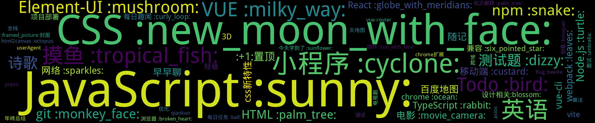

    
    
    
    
    
    
    

    

## 置顶 :thumbsup: 
- [封面图](https://github.com/smileyby/notes-copy/issues/1)  0 :speech_balloon:  	 
## 最新 :new: 

#### [小程序：微信更新7.0.10后，onShow 中 调用wx.hideLoading失效](https://github.com/smileyby/notes-copy/issues/19) 0 :speech_balloon: 	 2021-05-25 09:32:42

:label: : [小程序 :cyclone:](https://github.com/smileyby/ghiblog/labels/%E5%B0%8F%E7%A8%8B%E5%BA%8F%20%3Acyclone%3A)

https://developers.weixin.qq.com/community/develop/doc/0006ac8c628d508af4a9970985ec00

[更多>>>](https://github.com/smileyby/notes-copy/issues/19)

---

#### [小程序：云开发](https://github.com/smileyby/notes-copy/issues/18) 0 :speech_balloon: 	 2021-05-25 09:31:12

:label: : [小程序 :cyclone:](https://github.com/smileyby/ghiblog/labels/%E5%B0%8F%E7%A8%8B%E5%BA%8F%20%3Acyclone%3A)

云开发：
小程序开通云服务
创建数据库-数据集合（基础版本，集合最多100个）
集合创建完成，在小程序端按照文档获取数据库数据时，需要先给database集合设置权限；（数据库的权限默认是创建者可读写）

[更多>>>](https://github.com/smileyby/notes-copy/issues/18)

---

#### [小程序：{{}}取值运算符，不能运行indexOf方法的解决办法](https://github.com/smileyby/notes-copy/issues/17) 0 :speech_balloon: 	 2021-05-25 09:12:22

:label: : [小程序 :cyclone:](https://github.com/smileyby/ghiblog/labels/%E5%B0%8F%E7%A8%8B%E5%BA%8F%20%3Acyclone%3A)

1.创建wxs文件
function indexOf(arr, value){
  if (arr.indexOf(value) < 0) {
    return false;
  } else {
    return true;
  }
}
module.exports = {

[更多>>>](https://github.com/smileyby/notes-copy/issues/17)

---

#### [小程序：video播放器设置opacity:0在ios设备上不能播放 ](https://github.com/smileyby/notes-copy/issues/16) 0 :speech_balloon: 	 2021-05-25 09:11:44

:label: : [小程序 :cyclone:](https://github.com/smileyby/ghiblog/labels/%E5%B0%8F%E7%A8%8B%E5%BA%8F%20%3Acyclone%3A)

[更多>>>](https://github.com/smileyby/notes-copy/issues/16)

---

#### [小程序：扫码打开对应界面，接收的参数](https://github.com/smileyby/notes-copy/issues/15) 0 :speech_balloon: 	 2021-05-25 09:11:15

:label: : [小程序 :cyclone:](https://github.com/smileyby/ghiblog/labels/%E5%B0%8F%E7%A8%8B%E5%BA%8F%20%3Acyclone%3A)

掉小程序接口：https://api.weixin.qq.com/wxa/getwxacodeunlimit?access_token=ACCESS_TOKEN

通过scene传参，格式为 '?scene=xxxxx'

小程序拿到后decodeURIComponent 转码后才可以解析

[更多>>>](https://github.com/smileyby/notes-copy/issues/15)

---

## 分类  :card_file_box: 

    

        
        
:cloud: 词云 :cloud: 点击词云展开详细分类:point_down: 

    

:+1:置顶	1:newspaper:

- [封面图](https://github.com/smileyby/notes-copy/issues/1)  0 :speech_balloon:  	 

:framed_picture:封面	1:newspaper:

- [封面图](https://github.com/smileyby/notes-copy/issues/1)  0 :speech_balloon:  	 

Bug :beetle:	0:newspaper:

CSS :new_moon_with_face:	0:newspaper:

Element-UI :mushroom:	0:newspaper:

HTML :palm_tree:	0:newspaper:

Node.js :turtle:	0:newspaper:

React :globe_with_meridians:	0:newspaper:

TypeScript :rabbit:	0:newspaper:

VUE :milky_way:	0:newspaper:

git :monkey_face:	0:newspaper:

webpack :leaves:	0:newspaper:

兼容 :six_pointed_star:	0:newspaper:

小程序 :cyclone:	10:newspaper:

- [小程序：请求接口报错：-202::NET::ERR_CERT_AUTHORITY_INVALID](https://github.com/smileyby/notes-copy/issues/20)  0 :speech_balloon:  	 
- [小程序：微信更新7.0.10后，onShow 中 调用wx.hideLoading失效](https://github.com/smileyby/notes-copy/issues/19)  0 :speech_balloon:  	 
- [小程序：云开发](https://github.com/smileyby/notes-copy/issues/18)  0 :speech_balloon:  	 
- [小程序：{{}}取值运算符，不能运行indexOf方法的解决办法](https://github.com/smileyby/notes-copy/issues/17)  0 :speech_balloon:  	 
- [小程序：video播放器设置opacity:0在ios设备上不能播放 ](https://github.com/smileyby/notes-copy/issues/16)  0 :speech_balloon:  	 
- [小程序：扫码打开对应界面，接收的参数](https://github.com/smileyby/notes-copy/issues/15)  0 :speech_balloon:  	 
- [小程序：同一个元素 绑定长按和点击事件，两个事件会同时执行](https://github.com/smileyby/notes-copy/issues/14)  0 :speech_balloon:  	 
- [小程序：wx.setStorageSync()和wx.setStorage()两个方法接受的参数不一致](https://github.com/smileyby/notes-copy/issues/13)  0 :speech_balloon:  	 
- [小程序：thirdScriptError Cannot read property 'name' of undefined TypeError: Cannot read property 'name' of undefined](https://github.com/smileyby/notes-copy/issues/12)  0 :speech_balloon:  	 
- [小程序：scroll-view 组件 scroll-left 问题](https://github.com/smileyby/notes-copy/issues/10)  0 :speech_balloon:  	 

开源	0:newspaper:

插件 :sun_with_face:	0:newspaper:

摸鱼 :tropical_fish:	0:newspaper:

每日任务 :bell:	0:newspaper:

浏览器 :broken_heart:	0:newspaper:

网络 :sparkles:	0:newspaper:

设计相关:blossom:	0:newspaper:

面试 :umbrella:	0:newspaper:

    
